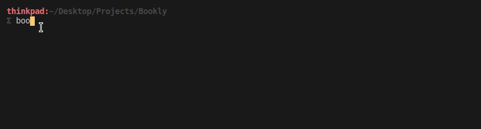

# Bookly
Bookly is a REPL program for managing my blog. It is built using the `click` and `click-repl` libraries
and interfaces with a MongoDB database hosted on Mongo Atlas via the `mongoengine` library.

It currently supports viewing all posts, viewing a post by title, uploading a new post,
and deleting a post. I have required that blog post titles be unique to prevent accidental double-posting.

For uploading posts, Bookly expects a txt file of the form

```
Title: A Title
Tags: tag1, tag2, ...
Content: Multiple lines of content. Multiple lines of content. Multiple lines of content.
Multiple lines of content. Multiple lines of content. Multiple lines of content.
Multiple lines of content. 
```
The actual name of each section doesn't matter as long as the colon seperates the content and the name of the section.


I plan to add functionality for updating a post, a `rich` dashboard for viewing stats about the blog, and restructuring the project in such a way so that it can be uploaded to PyPI and others can use it to manage their own MongoDB-hosted blogs. 

Currently, Bookly relies on a `.env` file containing a `MONGO_URI` connection string to 
connect to the remote database so if you wanted to use this for your own blog the process to install it would be

- Clone this repository
- Navigate to the root directory of the project
- Add a `.env` file containing a variable like `MONGO_URI=xxxxxxxxxxxxxxxxxxxxxxx`
- Run `python setup.py install`
- You should now be able to run `bookly` from anywhere on your machine

Run `bookly --help` to see the available commands and `bookly (command) --help` to see the usage for a command.
Thanks to the `click` library, Bookly has autocompletion. Use `end` to exit Bookly gracefully. Here's a usage example:


